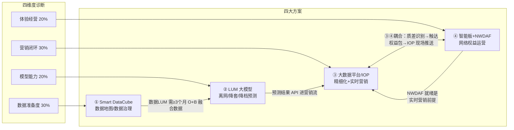

> ⚠️ 本卡片由 AI 基于知识库既有卡片起草，待机关复核后方为金标准。sources 见 frontmatter。

# 开方逻辑 · 诊断与四大方案映射

## 一句话概要

存量经营分省作战的开方原则=「诊断开方+依赖链」：先用四维度成熟度诊断（数据准备度30%/模型能力20%/营销闭环30%/体验经营20%）定位短板，再按「维度↔方案」一一映射开出方案动作；数据<L3 的省强制先方案①后方案②（LUM 需≥3 个月 O域+B域融合数据），实时营销场景需方案④ NWDAF 就绪，方案③④天然耦合。

---

## 1. 总图：四维度 ↔ 四大方案映射

| # | 评估维度（权重） | 对应方案 | 方案内核 | 锚定产品卡 |
|---|---|---|---|---|
| ① | 数据准备度（30%） | Smart DataCube 数据地图/数据治理 | O+B+S 三域融合数据底座，先摸清数据家底再谈 AI | [[03_产品方案竞争力/SmartCare/SmartCare]] |
| ② | 场景化模型能力（20%） | LUM 大模型泛化预测（离网/降套/降档） | 0.5B 用户行为大模型替代传统小模型，查准/查全双升 | [[03_产品方案竞争力/无线智能化运营/无线智能化运营]] |
| ③ | 营销闭环能力（30%） | 大数据平台/IOP 精细化营销 + 实时营销 | 预测结果进营销生产流，从「看得见」到「触达得了」 | [[04_上市GTM/SmartCare GTM]] |
| ④ | 体验经营（20%） | 无线智能板 + NWDAF 网络权益运营 | 高价值用户保有 + 权益增收双轮 | [[07_案例集/标杆案例/分层分级体验经营-NWDAF与智能板协同]] |

**依赖链三条铁律**（开方顺序不可违反）：

1. **①前置于②**：数据准备度<L3 的省，强制先开方案①再开方案②——LUM 离网预测训练样本要求**至少 3 个月的 O域+B域指标**（广西孵化口径，源_MWC2026-展屏讲解汇总）。数据没融合，模型是空中楼阁。
2. **④NWDAF 就绪前置于实时营销**：实时营销场景（方案③高阶形态）依赖 NWDAF 实时质差识别作为事件源——广东实时营销全链路为 O域话单→事件中心/NWDAF 实时质差识别→FI Kafka→IOP 实时策划→短信触达（[[05_营销策划/区域营销方案/广东移动差异化体验经营]]）。
3. **③④耦合**：体验经营的「可营销」环节（NWDAF 识别质差潜客→B域短信邀约）本身就是营销闭环的一段；场馆包/高铁包的现场精准推送靠 IOP 完成 C2C 裂变。③④同开时优先打通 NWDAF-IOP 接口（广东经验：红线断点即 NWDAF-IOP）。

---

## 2. 诊断开方表（按维度 × 当前 L 级逐级开方）

> L 级定义以本方案《成熟度模型》卡为准；本表只回答「诊断到这一级，开什么、干成什么样算进阶」。

### ① 数据准备度（30%）→ 方案① Smart DataCube

| 当前 | 开方动作 | 进阶到 L+1 的标志 |
|---|---|---|
| L1 | 数据地图咨询：盘点 O/B/S 三域数据资产、质量与归属（对照广东 LUM 需求清单：月粒度 415 字段九大类） | 数据资产清单+差距报告成文，客户认可差距 |
| L2 | 数据治理工程：补采质差字段、统一口径；Smart DataCube 预集成（PM/FM/CRM/Billing），上线 TTM<1 个月 | O+B 关键域打通，LUM 所需字段可持续供给≥3 个月 |
| L3 | 融合底座扩容：多维关联（用户×位置×业务×体验），接入智能板 5 秒粒度数据 | 跨域数据作业天级交付（对标 @930 天/表），支撑按天推理 |
| L4 | DataChat 从问数闭环叠加：700+ O+B 域指标即时问数（@630 口径） | 数据服务化：营销/网优/客服多部门自助用数 |

### ② 场景化模型能力（20%）→ 方案② LUM

| 当前 | 开方动作 | 进阶到 L+1 的标志 |
|---|---|---|
| L1 | 不直接开②——先补①；可先用客户既有小模型基线摸底（业界小模型降档查准率平均约 25%） | 数据准备度达 L3（依赖链铁律 1） |
| L2 | LUM 单场景 PoC（离网或降档二选一）：预训练+监督训练各一周（广西节奏），月粒度数据 | 单场景指标过基线：对标广西降档查准率 72.54%/查全率 57.26% vs 小模型 17.66%/30.65% |
| L3 | LUM 商用部署+第二场景泛化（离网+降档+降套），Smart Decision 经 API 调用 LUM 结果 | 双场景稳定运行，预测周期从月向天演进（叠加智能板细粒度数据） |
| L4 | 多场景泛化工厂：对齐 15+ 场景泛化、跨场景泛化≤6 天路标（2026.10 TR6） | 新场景上线≤6 天，预测能力成为全省营销标配 |

### ③ 营销闭环能力（30%）→ 方案③ 大数据平台/IOP

| 当前 | 开方动作 | 进阶到 L+1 的标志 |
|---|---|---|
| L1 | 清单式营销起步：LUM/模型输出高危清单，人工外呼+短信批量触达（模式 B 最小形态） | 预测清单进入营销例行生产流，有转化率统计 |
| L2 | 精细化分群营销：套餐饱和度分层运营（对标河南 <25% 防降套 / >80% 促升套，降档用户减少 35%） | 分群策略例行化，商机转化率有基线与提升目标（对标河南 5%→6.8%） |
| L3 | 实时营销通道建设：打通 NWDAF→FI Kafka→IOP 接口（需④就绪，依赖链铁律 2），CEP 事件驱动分钟级触达 | 至少 1 个实时场景商用（Smart Decision 支持 5 大类 15 小类、分钟级触达） |
| L4 | 营销智能体：活动策划 TTM 天级→小时级，泛化场景转化率提升 20%（2026.10 TR6 路标） | 策划-执行-评估闭环自动化，营销活动可自优化 |

### ④ 体验经营（20%）→ 方案④ 智能板+NWDAF

| 当前 | 开方动作 | 进阶到 L+1 的标志 |
|---|---|---|
| L1 | 合规背书导入：宣贯集团《客户分层分级网络保障服务业务规范》（质差后下行最低 10Mbps/上行 4Mbps），选 1 个价值场景试点 NWDAF 用户分层 | 客户接受分层分级理念，试点场景选定 |
| L2 | NWDAF 一阶段：用户级分层保障+质差识别（对标广东高铁包一阶段），套餐模板库选型上市 | 首个权益包商用（参考天津/北京/广东模板） |
| L3 | 智能板二阶段：NWDAF+智能板协同，用户级+业务级差异化（智能板独立增益超 30%），价值场景成片部署 | 商用数据可讲：对标河南高铁包高清+26%、北京工体 VIP 速率+4.4 倍且普通用户无损 |
| L4 | 规模化权益运营：全省价值区域部署（对标广东 711 块板→规模 5092 片），漫入变现+B2B2C 模式叠加 | 体验经营成为收入科目：权益用户规模化（对标天津 5 个月 8 万权益用户、ARPU+9 元） |

---

## 3. 方案① Smart DataCube 数据地图/数据治理

- **一句话定位**：O+B+S 三域融合数据底座——「数据质量决定 AI 决策精度」，是其余三方案的地基。
- **适用档位**：数据准备度 L1~L3 的省全部适用；T4 起步梯队的主打方案（地基工程+咨询切入）。
- **进入条件**：无硬性前置——本方案就是别人的前置。切入姿势：数据地图咨询先行，用差距报告撬动治理工程。
- **关键参数**（均有 KB 出处）：
  - 预集成 BSS/运维等领域数据，上线 **TTM<1 个月**；某运营商现网每日处理数据量达 **27 PB**。
  - 平台轻量化：**5 台服务器降到 3 台**（MWC2026 展屏口径）。
  - 需求侧标尺：广东 LUM 落地需月粒度 **415 个字段**（九大类），而广东现状「BI 开放给 IOP 的表很少、仅能匹配十几个字段」——这就是典型的 L2 诊断证据。
  - 数据安全三原则：数据不出客户网络、脱敏/聚合后训练、访问控制双因子（广东「虎符」方案已过移动集团数据安全评审，见 [[03_产品方案竞争力/ADN/常见异议应对]]）。
- **商业量纲**：参考单价 Smart DataCube **$0.7M**（预算引导 landscape 口径）；沙特 STC 拆单中数据治理底座 **1M USD**（10M 总盘）。国内分省报价需按集采格局另议（推断）。
- **双链**：[[03_产品方案竞争力/SmartCare/SmartCare]]｜[[04_上市GTM/SmartCare GTM]]｜[[03_产品方案竞争力/智能化运维运营/常见异议应对]]（数据准备度异议话术）｜[[03_产品方案竞争力/SmartCare/预算引导/总部预算引导雷达]]

## 4. 方案② LUM 大模型泛化预测（离网/降套/降档）

- **一句话定位**：华为自研 GTS-LUM 用户行为大模型（0.5B，GNN+Transformer），把离网/降档预测从小模型的「撒网」升级为「点射」。
- **适用档位**：数据准备度≥L3 且模型维度 L2~L4 的省；T2 发展梯队补模型短板的首选。
- **进入条件（硬门槛）**：**至少 3 个月的 O域+B域指标样本**（依赖链铁律 1 的出处）。数据<L3 一律先开①。
- **关键参数**：
  - 算力量纲：**3000 万用户需 3 台智算服务器（泰山 260）**（MWC2026 屏1 FAQ 口径）；另一口径为 3000 万用户 7 天预训练需 **16 张昇腾 910B3/B4（2 台智算服务器）**（广东差异化体验经营卡）。⚠️ **两口径并存，疑似硬件代际/配置差异，待机关复核归一**。
  - 效果锚点（多口径并存，按场景选用）：离网预测**准确率 70%@查全率 30%、预测未来 2 个月**（广西孵化、展屏口径）；广西实测（150 万基数、202501）查全率 41.5%/查准率 43.6%；MWC 标杆表口径广西/广东查准率达 75%。⚠️ 口径差异已在 _待复核_202606摄入 挂账。
  - 降档预测（广西 202412 实测）：查全率 **57.26%**、查准率 **72.54%**，同期小模型仅 30.65%/17.66%。
  - 泛化路标：支撑 **15+ 场景泛化、跨场景泛化≤6 天**（2026.10 TR6）；营销预测 GA **2026.04**。
- **商业量纲（单卖模式，即方案③模式 B 的弹药）**：**硬件（1 台 910B 智算+3 台通算+N 台 Hadoop）+ LUM 基础软件 + 维系辅助运营服务** 打包单卖；海外为 Smart Decision（$0.5M/局点基础价）+LUM 组合。
- **双链**：[[03_产品方案竞争力/无线智能化运营/无线智能化运营]]（智能板×LUM 协同定位）｜[[05_营销策划/区域营销方案/广东移动差异化体验经营]]｜[[05_营销策划/MWC展会/MWC2026/标杆案例与量化成效]]｜[[07_案例集/报量与商业模式/异议应对与待验证事项]]（算力未到位风险）

## 5. 方案③ 大数据平台/IOP 精细化营销 + 实时营销

- **一句话定位**：把预测结果变成触达与转化——精细化分群营销例行化，再升级 NWDAF 事件驱动的分钟级实时营销。
- **适用档位**：营销闭环 L1~L4 全档适用，但形态按格局分裂为双模式（见下表）；实时营销形态仅限④NWDAF 就绪省。
- **进入条件**：模式 A 需「大数据平台+IOP 均华为」的强格局；模式 B 无格局要求，LUM 单卖即可切入。
- **关键参数**：
  - IOP(UDM/UAP) 格局：**仅中国移动有格局**；强格局省包括**河北、天津、广西、湖南**等（屏1 FAQ 口径）。
  - Smart Decision 实时营销：**5 大类 15 小类场景、分钟级触达**；CEP 人群过滤的 200 万用户限制已后移取消。
  - 成效锚点：河南商机转化率 **5%→6.8%（+35%）**、25 年高价值用户净增 **100 万+**、MBB 收入年增 **3%**；河北长安区网市协同潜客清单 1905 户、升档转化率 6.8%/户均增收 21.2 元。
  - 红线：营销转化率承诺（如 30%）因数据开放归属客户「**无法承诺成效**」（SEC 竞争力 0320 结论，见 [[04_上市GTM/SmartCare GTM]]）——合同只承诺能力不承诺转化。
- **商业量纲**：模式 A 走大数据平台/IOP 存量扩容+软件；模式 B 即 LUM 硬+软+服打包单卖（见方案②）。
- **双链**：[[04_上市GTM/SmartCare GTM]]｜[[07_案例集/项目作战复盘/河北移动网市协同作战复盘]]｜[[07_案例集/项目作战复盘/安徽移动TOP1智能板作战复盘]]（河南 O+B 分层运营）｜[[00_原始素材/源_MWC2026-展屏讲解汇总]]

### 方案③双模式详表

| 维度 | 模式 A：强格局省端到端旗舰 | 模式 B：友商格局省 LUM 单卖 |
|---|---|---|
| 适用省 | 大数据平台+IOP 均华为：广西/河北/天津/湖南型 | 大数据/营销平台为友商（亚信等）的省 |
| 技术形态 | NWDAF→FI Kafka→IOP 端到端实时营销（广东已验证链路） | LUM 单卖+API 输出，被集成到客户自有大数据/营销平台 |
| 华为边界 | 端到端：识别→策划→触达全链路 | 只出预测结果，**不碰执行层**（触达/策划归客户平台） |
| 商业包 | 平台扩容+实时营销软件+场景运营 | 硬件（1 台 910B+3 台通算+N 台 Hadoop）+LUM 基础软件+维系辅助运营服务 |
| 集成方式 | 华为体系内原生集成 | O/B/S 三域接口（Kafka/JDBC/SFTP），现网经亚信能力网关中转 |
| 打单要点 | 打「分钟级实时营销」旗舰样板，树全国标杆 | 打「查准率 72.54% vs 小模型 17.66%」的模型代差，避开平台之争 |

## 6. 方案④ 无线智能板+NWDAF 网络权益运营

- **一句话定位**：网络线主打——用 NWDAF（用户级分层）+智能板（业务级调度）做「高价值用户保有+权益增收」双轮。
- **适用档位**：体验经营 L1~L4 全档；T1 先锋梯队的主打方案；也是实时营销（方案③高阶）的前置基础设施。
- **进入条件**：5G-A 商用基础（全国 25 省/38 家运营商已发 5G-A 套餐，移动 20 省）；商用涉及核心网（AMF/PCF 配 PRA）+无线（智能板+RFSP 选频）+B 域（BOSS 产品配置）三域改造。红线：权益包发放前必须确认 BOSS 配置（曾有全球通用户购买后无法生效事故）。
- **关键参数**：智能板一块单板最大支持 **24 个小区**（收益测算多按 21 小区）；支持 **60+ Top APP**（25B 扩展 80+），NWDAF 约 30 种；智能板相对 NWDAF **独立增益超 30%**。
- **商业量纲**：智能板按板销售+权益包分成想象空间；参考 [[07_案例集/报量与商业模式/分层分级体验经营与商业模式]]「业务高速公路」模式（收高速费/收网保费）与 [[07_案例集/报量与商业模式/智能板定位与六大能力]]。
- **双链**：[[07_案例集/标杆案例/分层分级体验经营-NWDAF与智能板协同]]｜[[04_上市GTM/无线智能化运营GTM]]｜[[03_产品方案竞争力/无线智能化运营/竞争力与差异化]]｜[[07_案例集/标杆案例/深圳大运中心场馆智能协同保障]]

### 方案④三件套弹药清单

| 件 | 弹药 | 内容与数字 | 出处双链 |
|---|---|---|---|
| ① 合规背书 | 集团《客户分层分级网络保障服务业务规范》 | 高清视频/会议/直播质差后下行最低保障 10Mbps、上行 4Mbps——「集团规范允许干」是打消客户合规顾虑的第一句话 | [[07_案例集/标杆案例/分层分级体验经营-NWDAF与智能板协同]] |
| ② 套餐模板库 | 已商用可复制模板 | 天津地铁极速包（20 元 10GB/月，短视频/游戏体验+23~37%）；北京工体场馆包（30 元/4 小时+100G，全球通 0 元）；广东场馆包（30 元/次，含 5QI=6/NWDAF 加速 27 app/专属 LOGO/RFSP 优选 4.9G）+高铁加速包（5 元/天起）；深圳通勤地铁包/夜猫子包 | [[07_案例集/标杆案例/分层分级体验经营-NWDAF与智能板协同]]、[[07_案例集/报量与商业模式/分层分级体验经营与商业模式]] |
| ③ 商用数据 | 效果实证 | 河南高铁包：VIP 短视频高清占比 **+26%**、下载速率 **+10 倍**（郑州-新乡东 67 公里、51 块板）；北京工体：VIP 速率最高 **+4.4 倍且普通用户无损**；天津地铁权益包 5 个月 8 万权益用户、ARPU+9 元；江苏苏超每轮销售 500~2000+ 场馆包 | [[04_上市GTM/无线智能化运营GTM]]、[[03_产品方案竞争力/无线智能化运营/典型场景与话术]] |

---

## 7. 梯队作战模式表

| 梯队 | 定义（加权分） | 作战模式 | 主打方案 | 辅助动作 |
|---|---|---|---|---|
| T1 先锋 | ≥4.0 | 样板深化 | ④ + 实时营销（③高阶） | 树全国标杆、孵化企标（如广东 RFSP 用户等级方案）、输出模板给 T2/T3 |
| T2 发展 | 3.0~3.9 | 补短板放大 | 按诊断补最弱维度对应方案 | 复制 T1 套餐模板快速上量 |
| T3 基础 | 2.0~2.9 | 地基+试点 | ①为主，选 1 个④场景试点 | 数据<L3 门槛省一律落此档，先治数 |
| T4 起步 | <2.0 | 地基工程 | ① + 咨询 | 数据地图咨询切入，不急于卖模型/平台 |

### 剧本一：广西 = 强格局省模式 A 旗舰剧本

> 格局：强格局（大数据平台+IOP 均华为，屏1 FAQ 口径，置信度高）；LUM 全国孵化地。

| 步骤 | 动作 | 弹药/依据 |
|---|---|---|
| 1 | 巩固模型优势：LUM 离网（70%@查全 30%）/降档（查准 72.54%）双场景例行化，覆盖全区 3340 万用户（现有验证基于南宁 750 万/随机 150 万基数） | [[05_营销策划/区域营销方案/广东移动差异化体验经营]]（广西验证数据） |
| 2 | 打通实时营销链路：复用广东已验证的 NWDAF→FI Kafka→IOP 接口方案，建端到端分钟级实时营销旗舰 | 依赖链铁律 2；[[05_营销策划/区域营销方案/广东移动差异化体验经营]] |
| 3 | 叠加④权益运营：从套餐模板库选品（地铁/场馆包），NWDAF 质差潜客→IOP 短信邀约闭环 | ③④耦合；[[07_案例集/标杆案例/分层分级体验经营-NWDAF与智能板协同]] |
| 4 | 成果包装：作为「模式 A 全国旗舰」输出到其余强格局省（河北/天津/湖南） | MWC 标杆表已列广西查准 75% 口径 |

### 剧本二：广东 = T2（临界 T1）样板深化剧本

> 梯队：T2 发展、加权分 3.7、距 T1 一步之遥（12 月底已完成端到端网络能力搭建、全国最完整样板；**唯一压制在 T2 的是数据准备度 L3 的 B+O 融合断点**——补齐即升 T1，见 [[02_战略规划/存量经营分省作战/分档地图-31省双轴矩阵]] 与 [[02_战略规划/存量经营分省作战/省档案-广东]]）。

| 步骤 | 动作 | 弹药/依据 |
|---|---|---|
| 1 | 主打④规模化：从二阶段 711 块板（深圳 1.2 万小区）向客户建议的全网 4381 块（全年 5092 片）推进，华为独家中标 | [[04_上市GTM/无线智能化运营GTM]] |
| 2 | 权益包上量：场馆包（30 元/次已上线）/高铁包/地铁包组合，叠加 B2B2C（100 元/次进票价）与漫入变现（深圳漫入占比 40%+、结算 1.35 元/GB） | [[07_案例集/标杆案例/深圳大运中心场馆智能协同保障]]、[[05_营销策划/区域营销方案/广东移动差异化体验经营]] |
| 3 | 补数据短板（T1 也有 L2 维度）：广东 BI 开放给 IOP 仅十几个字段 vs LUM 需求 415 字段——推动①数据打通，支撑 L2-LUM 里程碑（2026/1~6，6 月底完成部署及数据准备） | [[05_营销策划/区域营销方案/广东移动-智联粤移网绘未来]] |
| 4 | 模型深化：LUM+智能板 5 秒粒度数据把降档预测从约 20% 提升到查准/查全均 40%+、周期从月到天（月均降档 80~100 万户、年损失约 20 亿元的痛点牌） | [[07_案例集/项目作战复盘/广东移动智能板穿插作战复盘-三大主线10条经验]]、[[03_产品方案竞争力/无线智能化运营/典型场景与话术]] |
| 5 | 风险盯防：LUM 算力服务器（16 张 910B3+6 台 Taishan+20T 存储）到位进度是主要延期风险 | [[07_案例集/报量与商业模式/异议应对与待验证事项]] |

---

## 8. 与旧卡口径差异挂账（不静默覆盖）

| 事项 | 口径 A | 口径 B | 处理 |
|---|---|---|---|
| LUM 算力量纲 | 3000 万用户需 3 台智算（泰山 260）——MWC2026 屏1 | 3000 万用户 7 天预训练需 16 张 910B3（2 台智算）——广东卡 | 并列呈现，待机关归一（_待复核_202606摄入 已挂账） |
| LUM 离网预测效果 | 70%@查全 30%（展屏）/ 查准 75%（MWC 标杆表） | 广西实测 41.5%/43.6%（202501）；广东项目定位表 43% | 对外用展屏口径、对内评估用实测口径，标注场景与基数 |
| 四川减损公式 | 2700 人/月×12 月×ARPU108×12×2 年 | —— | 疑似双重×12 笔误，引用时只说「千万级/年」，待复核 |
| 广东=T1 梯队定级 | 本卡按框架推断 | 待成熟度打分卡出分 | 显式标注「推断」 |
